# Plumbfix Business Activity Diagrams (BAD)

This document provides the complete set of **24 Business Activity Diagrams (BAD001 through BAD024)** for the **Plumbfix Plumbing Management System**. Each diagram represents the partitioned swimlane workflow between the **Actor (Customer / Staff / Admin)** and the **System**.

---

## Table of Contents

1. [4.4.1 BAD001: Login](#441-bad001-login)
2. [4.4.2 BAD002: Create Account](#442-bad002-create-account)
3. [4.4.3 BAD003: View Account](#443-bad003-view-account)
4. [4.4.4 BAD004: Update Account](#444-bad004-update-account)
5. [4.4.5 BAD005: Delete Account](#445-bad005-delete-account)
6. [4.4.6 BAD006: Create Booking](#446-bad006-create-booking)
7. [4.4.7 BAD007: View Booking](#447-bad007-view-booking)
8. [4.4.8 BAD008: Update Booking](#448-bad008-update-booking)
9. [4.4.9 BAD009: Delete Booking](#449-bad009-delete-booking)
10. [4.4.10 BAD010: Create Payment](#4410-bad010-create-payment)
11. [4.4.11 BAD011: View Payment](#4411-bad011-view-payment)
12. [4.4.12 BAD012: Update Payment](#4412-bad012-update-payment)
13. [4.4.13 BAD013: Create Refund](#4413-bad013-create-refund)
14. [4.4.14 BAD014: View Refund](#4414-bad014-view-refund)
15. [4.4.15 BAD015: Update Refund](#4415-bad015-update-refund)
16. [4.4.16 BAD016: Create Job Record](#4416-bad016-create-job-record)
17. [4.4.17 BAD017: View Job Record](#4417-bad017-view-job-record)
18. [4.4.18 BAD018: Update Job Record](#4418-bad018-update-job-record)
19. [4.4.19 BAD019: Generate Report](#4419-bad019-generate-report)
20. [4.4.20 BAD020: Create Feedback](#4420-bad020-create-feedback)
21. [4.4.21 BAD021: View Feedback](#4421-bad021-view-feedback)
22. [4.4.22 BAD022: Create Chat Message](#4422-bad022-create-chat-message)
23. [4.4.23 BAD023: View Chat Messages](#4423-bad023-view-chat-messages)
24. [4.4.24 BAD024: View Push Notifications](#4424-bad024-view-push-notifications)

---

## Business Activity Diagrams

### 4.4.1 BAD001 Login

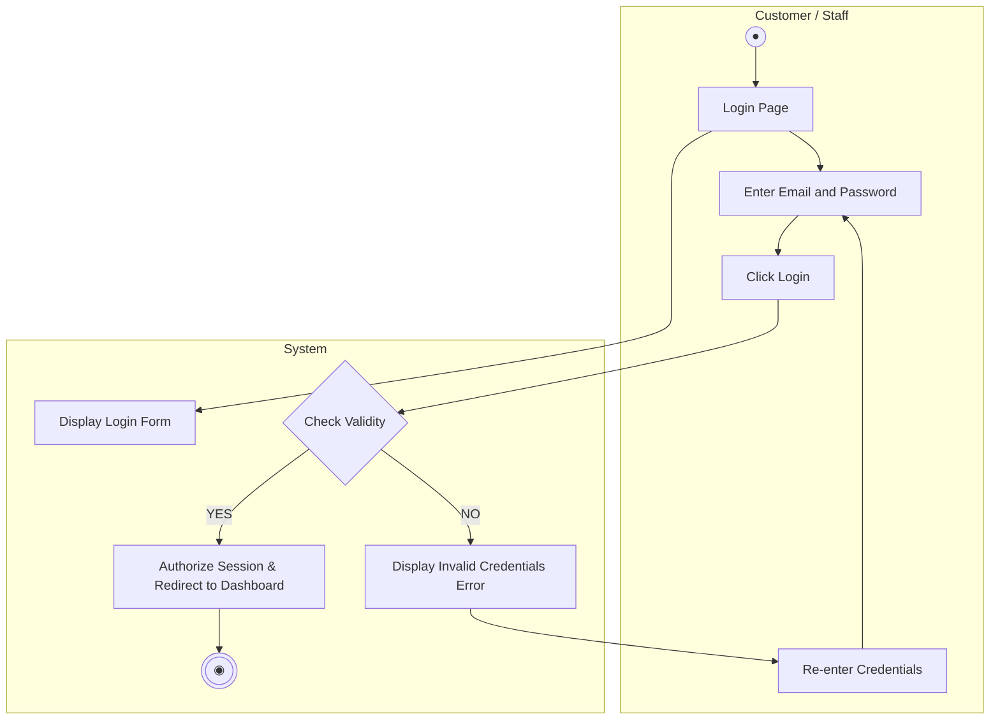
```mermaid
flowchart TD
    subgraph Actor_Lane ["Customer / Staff"]
        Start1((●)) --> A1[Login Page]
        A1 --> A2[Enter Email and Password]
        A2 --> A3[Click Login]
        A4[Re-enter Credentials] --> A2
    end

    subgraph System_Lane ["System"]
        S1[Display Login Form]
        S2{Check Validity}
        S3[Authorize Session & Redirect to Dashboard]
        S4[Display Invalid Credentials Error]
        End1(((◉)))

        A1 --> S1
        A3 --> S2
        S2 -- YES --> S3
        S2 -- NO --> S4
        S4 --> A4
        S3 --> End1
    end
```

---

### 4.4.2 BAD002 Create Account

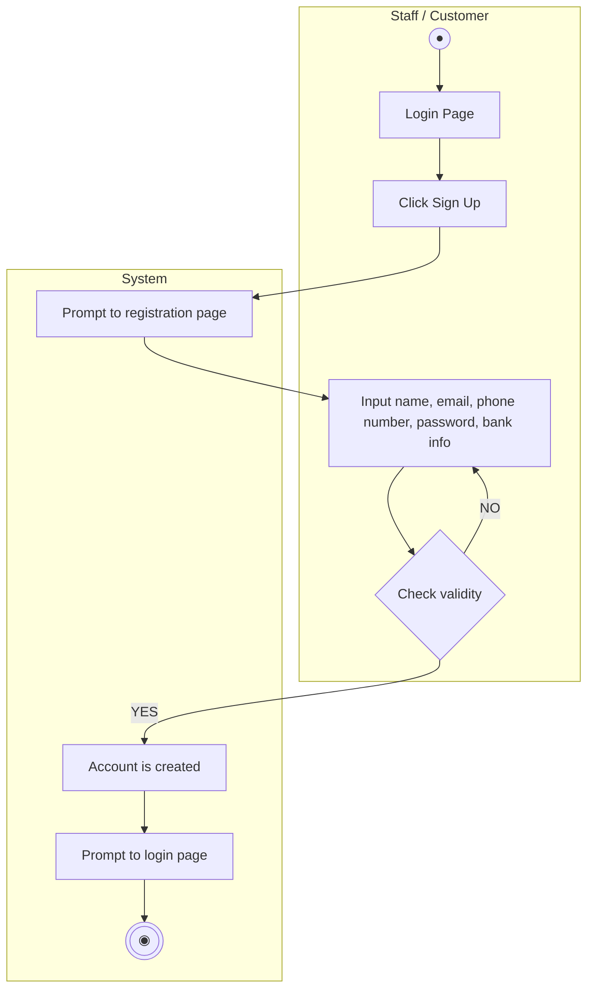
```mermaid
flowchart TD
    subgraph Actor_Lane ["Staff / Customer"]
        Start2((●)) --> A2_1[Login Page]
        A2_1 --> A2_2[Click Sign Up]
        A2_3[Input name, email, phone number, password, bank info] --> S2_2
    end

    subgraph System_Lane ["System"]
        S2_1[Prompt to registration page]
        S2_2{Check validity}
        S2_3[Account is created]
        S2_4[Prompt to login page]
        End2(((◉)))

        A2_2 --> S2_1
        S2_1 --> A2_3
        S2_2 -- NO --> A2_3
        S2_2 -- YES --> S2_3
        S2_3 --> S2_4
        S2_4 --> End2
    end
```

---

### 4.4.3 BAD003 View Account

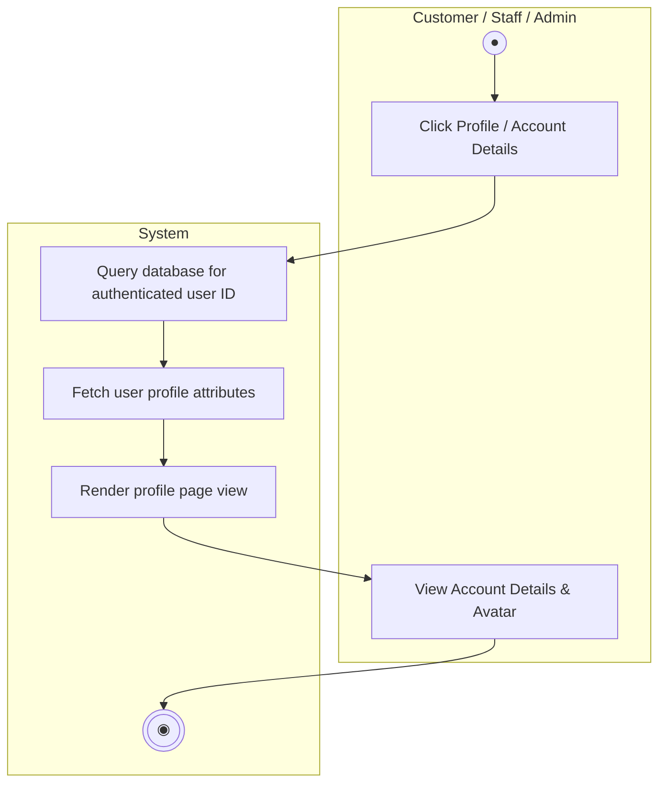
```mermaid
flowchart TD
    subgraph Actor_Lane ["Customer / Staff / Admin"]
        Start3((●)) --> A3_1[Click Profile / Account Details]
        A3_2[View Account Details & Avatar]
    end

    subgraph System_Lane ["System"]
        S3_1[Query database for authenticated user ID]
        S3_2[Fetch user profile attributes]
        S3_3[Render profile page view]
        End3(((◉)))

        A3_1 --> S3_1
        S3_1 --> S3_2
        S3_2 --> S3_3
        S3_3 --> A3_2
        A3_2 --> End3
    end
```

---

### 4.4.4 BAD004 Update Account

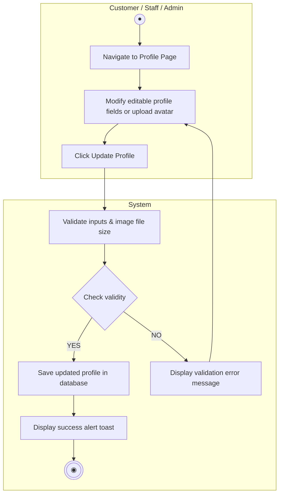
```mermaid
flowchart TD
    subgraph Actor_Lane ["Customer / Staff / Admin"]
        Start4((●)) --> A4_1[Navigate to Profile Page]
        A4_1 --> A4_2[Modify editable profile fields or upload avatar]
        A4_2 --> A4_3[Click Update Profile]
    end

    subgraph System_Lane ["System"]
        S4_1[Validate inputs & image file size]
        S4_2{Check validity}
        S4_3[Save updated profile in database]
        S4_4[Display success alert toast]
        S4_5[Display validation error message]
        End4(((◉)))

        A4_3 --> S4_1
        S4_1 --> S4_2
        S4_2 -- NO --> S4_5
        S4_5 --> A4_2
        S4_2 -- YES --> S4_3
        S4_3 --> S4_4
        S4_4 --> End4
    end
```

---

### 4.4.5 BAD005 Delete Account

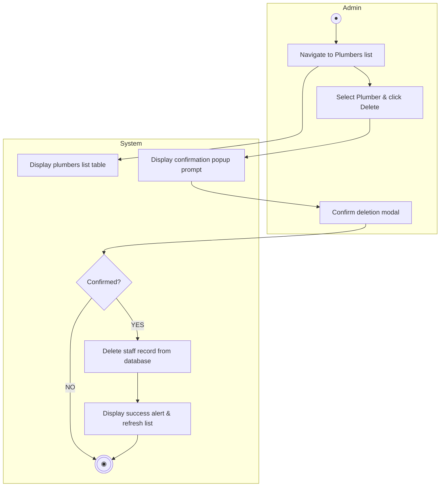
```mermaid
flowchart TD
    subgraph Actor_Lane ["Admin"]
        Start5((●)) --> A5_1[Navigate to Plumbers list]
        A5_1 --> A5_2[Select Plumber & click Delete]
        A5_3[Confirm deletion modal]
    end

    subgraph System_Lane ["System"]
        S5_1[Display plumbers list table]
        S5_2[Display confirmation popup prompt]
        S5_3{Confirmed?}
        S5_4[Delete staff record from database]
        S5_5[Display success alert & refresh list]
        End5(((◉)))

        A5_1 --> S5_1
        A5_2 --> S5_2
        S5_2 --> A5_3
        A5_3 --> S5_3
        S5_3 -- NO --> End5
        S5_3 -- YES --> S5_4
        S5_4 --> S5_5
        S5_5 --> End5
    end
```

---

### 4.4.6 BAD006 Create Booking

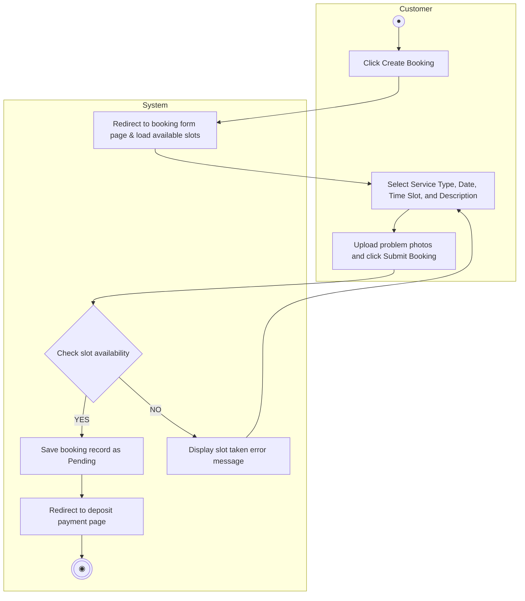
```mermaid
flowchart TD
    subgraph Actor_Lane ["Customer"]
        Start6((●)) --> A6_1[Click Create Booking]
        A6_2[Select Service Type, Date, Time Slot, and Description] --> A6_3
        A6_3[Upload problem photos and click Submit Booking]
    end

    subgraph System_Lane ["System"]
        S6_1[Redirect to booking form page & load available slots]
        S6_2{Check slot availability}
        S6_3[Save booking record as Pending]
        S6_4[Redirect to deposit payment page]
        S6_5[Display slot taken error message]
        End6(((◉)))

        A6_1 --> S6_1
        S6_1 --> A6_2
        A6_3 --> S6_2
        S6_2 -- NO --> S6_5
        S6_5 --> A6_2
        S6_2 -- YES --> S6_3
        S6_3 --> S6_4
        S6_4 --> End6
    end
```

---

### 4.4.7 BAD007 View Booking

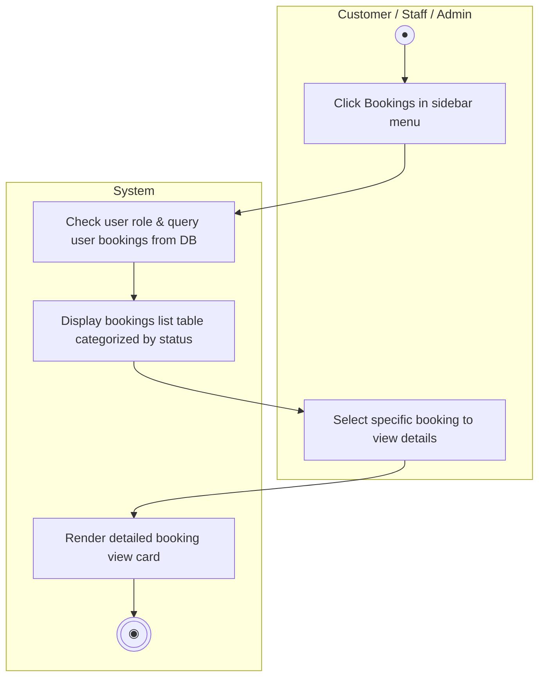
```mermaid
flowchart TD
    subgraph Actor_Lane ["Customer / Staff / Admin"]
        Start7((●)) --> A7_1[Click Bookings in sidebar menu]
        A7_2[Select specific booking to view details]
    end

    subgraph System_Lane ["System"]
        S7_1[Check user role & query user bookings from DB]
        S7_2[Display bookings list table categorized by status]
        S7_3[Render detailed booking view card]
        End7(((◉)))

        A7_1 --> S7_1
        S7_1 --> S7_2
        S7_2 --> A7_2
        A7_2 --> S7_3
        S7_3 --> End7
    end
```

---

### 4.4.8 BAD008 Update Booking

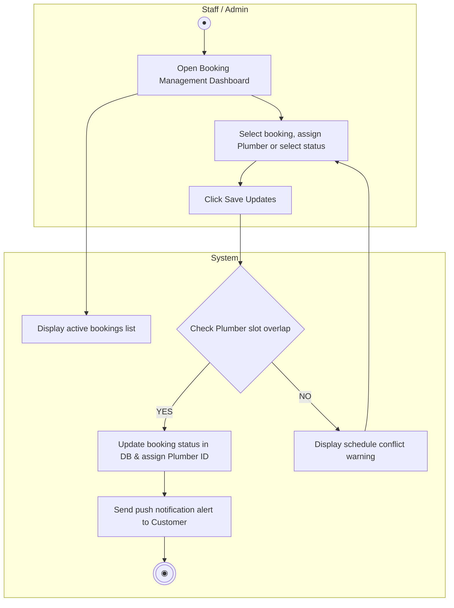
```mermaid
flowchart TD
    subgraph Actor_Lane ["Staff / Admin"]
        Start8((●)) --> A8_1[Open Booking Management Dashboard]
        A8_1 --> A8_2[Select booking, assign Plumber or select status]
        A8_2 --> A8_3[Click Save Updates]
    end

    subgraph System_Lane ["System"]
        S8_1[Display active bookings list]
        S8_2{Check Plumber slot overlap}
        S8_3[Update booking status in DB & assign Plumber ID]
        S8_4[Send push notification alert to Customer]
        S8_5[Display schedule conflict warning]
        End8(((◉)))

        A8_1 --> S8_1
        A8_3 --> S8_2
        S8_2 -- NO --> S8_5
        S8_5 --> A8_2
        S8_2 -- YES --> S8_3
        S8_3 --> S8_4
        S8_4 --> End8
    end
```

---

### 4.4.9 BAD009 Delete Booking

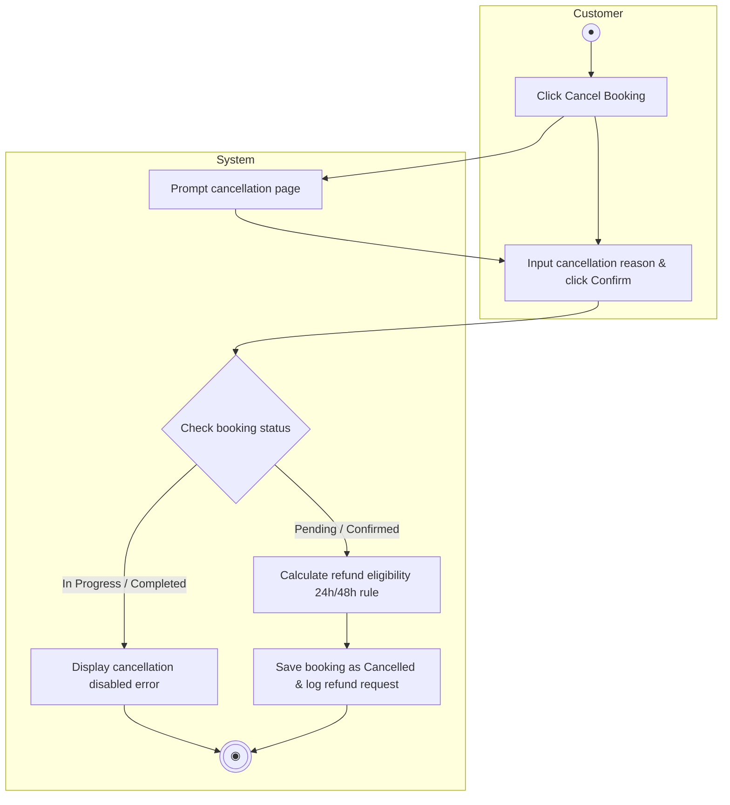
```mermaid
flowchart TD
    subgraph Actor_Lane ["Customer"]
        Start9((●)) --> A9_1[Click Cancel Booking]
        A9_1 --> A9_2[Input cancellation reason & click Confirm]
    end

    subgraph System_Lane ["System"]
        S9_1[Prompt cancellation page]
        S9_2{Check booking status}
        S9_3[Calculate refund eligibility 24h/48h rule]
        S9_4[Save booking as Cancelled & log refund request]
        S9_5[Display cancellation disabled error]
        End9(((◉)))

        A9_1 --> S9_1
        S9_1 --> A9_2
        A9_2 --> S9_2
        S9_2 -- In Progress / Completed --> S9_5
        S9_5 --> End9
        S9_2 -- Pending / Confirmed --> S9_3
        S9_3 --> S9_4
        S9_4 --> End9
    end
```

---

### 4.4.10 BAD010 Create Payment

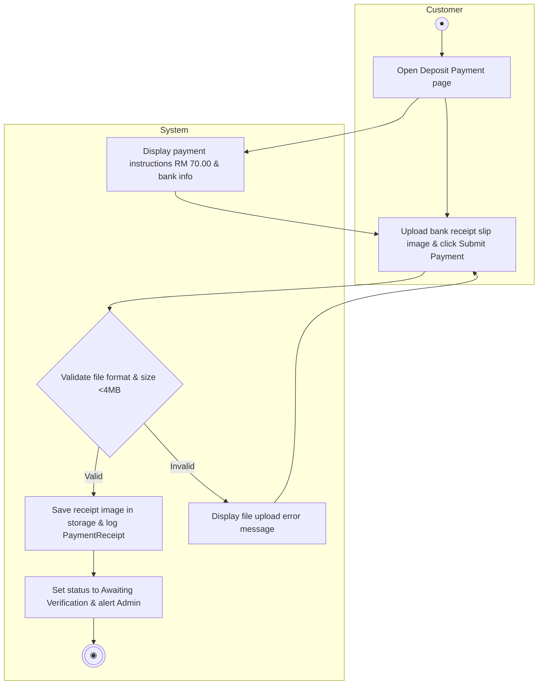
```mermaid
flowchart TD
    subgraph Actor_Lane ["Customer"]
        Start10((●)) --> A10_1[Open Deposit Payment page]
        A10_1 --> A10_2[Upload bank receipt slip image & click Submit Payment]
    end

    subgraph System_Lane ["System"]
        S10_1[Display payment instructions RM 70.00 & bank info]
        S10_2{Validate file format & size <4MB}
        S10_3[Save receipt image in storage & log PaymentReceipt]
        S10_4[Set status to Awaiting Verification & alert Admin]
        S10_5[Display file upload error message]
        End10(((◉)))

        A10_1 --> S10_1
        S10_1 --> A10_2
        A10_2 --> S10_2
        S10_2 -- Invalid --> S10_5
        S10_5 --> A10_2
        S10_2 -- Valid --> S10_3
        S10_3 --> S10_4
        S10_4 --> End10
    end
```

---

### 4.4.11 BAD011 View Payment

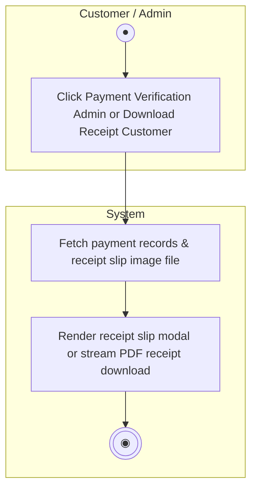
```mermaid
flowchart TD
    subgraph Actor_Lane ["Customer / Admin"]
        Start11((●)) --> A11_1[Click Payment Verification Admin or Download Receipt Customer]
    end

    subgraph System_Lane ["System"]
        S11_1[Fetch payment records & receipt slip image file]
        S11_2[Render receipt slip modal or stream PDF receipt download]
        End11(((◉)))

        A11_1 --> S11_1
        S11_1 --> S11_2
        S11_2 --> End11
    end
```

---

### 4.4.12 BAD012 Update Payment

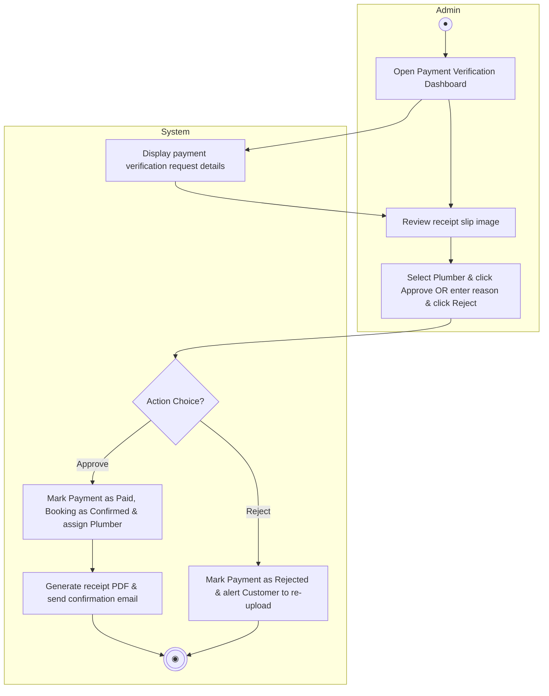
```mermaid
flowchart TD
    subgraph Actor_Lane ["Admin"]
        Start12((●)) --> A12_1[Open Payment Verification Dashboard]
        A12_1 --> A12_2[Review receipt slip image]
        A12_2 --> A12_3[Select Plumber & click Approve OR enter reason & click Reject]
    end

    subgraph System_Lane ["System"]
        S12_1[Display payment verification request details]
        S12_2{Action Choice?}
        S12_3[Mark Payment as Paid, Booking as Confirmed & assign Plumber]
        S12_4[Generate receipt PDF & send confirmation email]
        S12_5[Mark Payment as Rejected & alert Customer to re-upload]
        End12(((◉)))

        A12_1 --> S12_1
        S12_1 --> A12_2
        A12_3 --> S12_2
        S12_2 -- Approve --> S12_3
        S12_3 --> S12_4
        S12_4 --> End12
        S12_2 -- Reject --> S12_5
        S12_5 --> End12
    end
```

---

### 4.4.13 BAD013 Create Refund

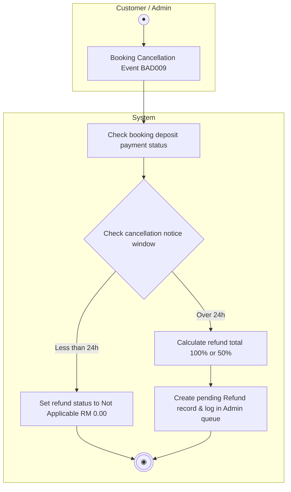
```mermaid
flowchart TD
    subgraph Actor_Lane ["Customer / Admin"]
        Start13((●)) --> A13_1[Booking Cancellation Event BAD009]
    end

    subgraph System_Lane ["System"]
        S13_1[Check booking deposit payment status]
        S13_2{Check cancellation notice window}
        S13_3[Set refund status to Not Applicable RM 0.00]
        S13_4[Calculate refund total 100% or 50%]
        S13_5[Create pending Refund record & log in Admin queue]
        End13(((◉)))

        A13_1 --> S13_1
        S13_1 --> S13_2
        S13_2 -- Less than 24h --> S13_3
        S13_3 --> End13
        S13_2 -- Over 24h --> S13_4
        S13_4 --> S13_5
        S13_5 --> End13
    end
```

---

### 4.4.14 BAD014 View Refund

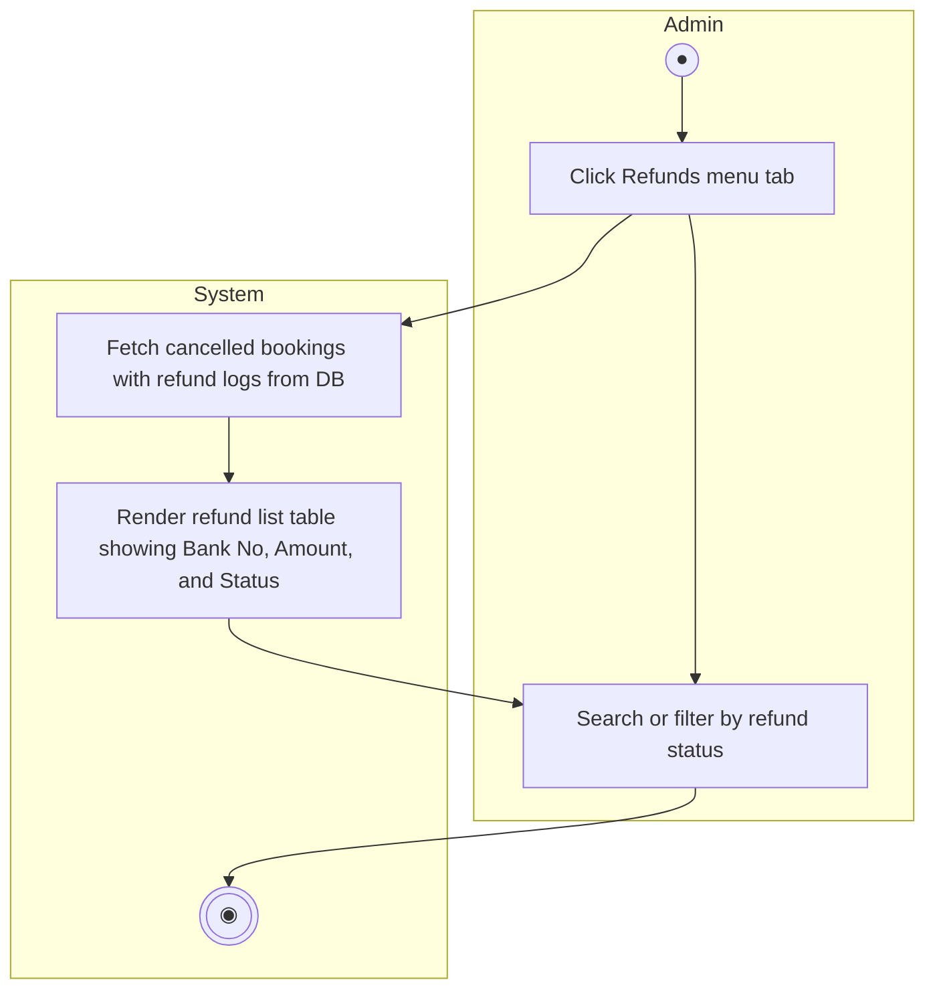
```mermaid
flowchart TD
    subgraph Actor_Lane ["Admin"]
        Start14((●)) --> A14_1[Click Refunds menu tab]
        A14_1 --> A14_2[Search or filter by refund status]
    end

    subgraph System_Lane ["System"]
        S14_1[Fetch cancelled bookings with refund logs from DB]
        S14_2[Render refund list table showing Bank No, Amount, and Status]
        End14(((◉)))

        A14_1 --> S14_1
        S14_1 --> S14_2
        S14_2 --> A14_2
        A14_2 --> End14
    end
```

---

### 4.4.15 BAD015 Update Refund

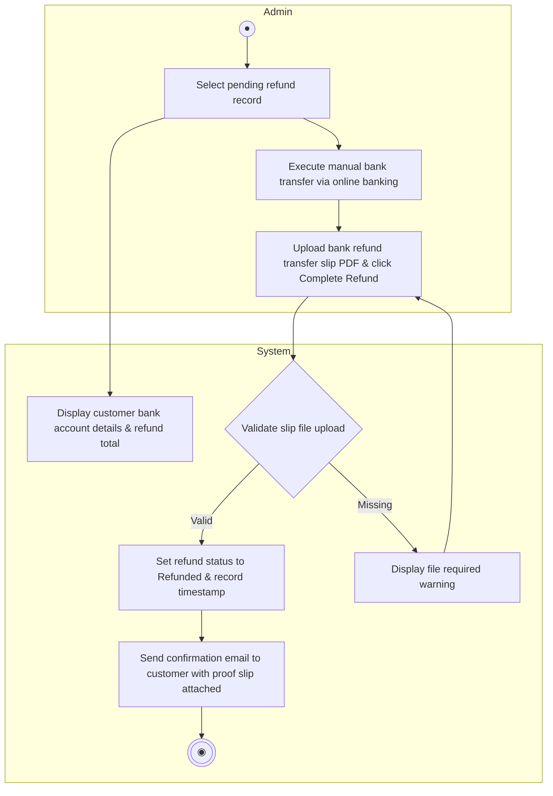
```mermaid
flowchart TD
    subgraph Actor_Lane ["Admin"]
        Start15((●)) --> A15_1[Select pending refund record]
        A15_1 --> A15_2[Execute manual bank transfer via online banking]
        A15_2 --> A15_3[Upload bank refund transfer slip PDF & click Complete Refund]
    end

    subgraph System_Lane ["System"]
        S15_1[Display customer bank account details & refund total]
        S15_2{Validate slip file upload}
        S15_3[Set refund status to Refunded & record timestamp]
        S15_4[Send confirmation email to customer with proof slip attached]
        S15_5[Display file required warning]
        End15(((◉)))

        A15_1 --> S15_1
        A15_3 --> S15_2
        S15_2 -- Missing --> S15_5
        S15_5 --> A15_3
        S15_2 -- Valid --> S15_3
        S15_3 --> S15_4
        S15_4 --> End15
    end
```

---

### 4.4.16 BAD016 Create Job Record

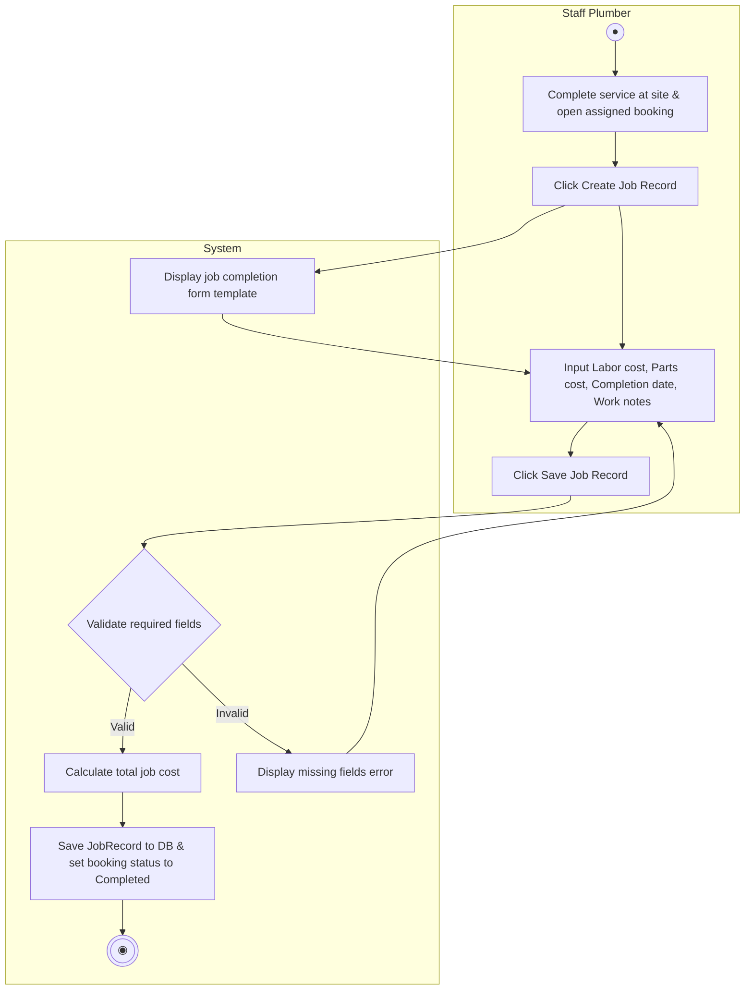
```mermaid
flowchart TD
    subgraph Actor_Lane ["Staff Plumber"]
        Start16((●)) --> A16_1[Complete service at site & open assigned booking]
        A16_1 --> A16_2[Click Create Job Record]
        A16_2 --> A16_3[Input Labor cost, Parts cost, Completion date, Work notes]
        A16_3 --> A16_4[Click Save Job Record]
    end

    subgraph System_Lane ["System"]
        S16_1[Display job completion form template]
        S16_2{Validate required fields}
        S16_3[Calculate total job cost]
        S16_4[Save JobRecord to DB & set booking status to Completed]
        S16_5[Display missing fields error]
        End16(((◉)))

        A16_2 --> S16_1
        S16_1 --> A16_3
        A16_4 --> S16_2
        S16_2 -- Invalid --> S16_5
        S16_5 --> A16_3
        S16_2 -- Valid --> S16_3
        S16_3 --> S16_4
        S16_4 --> End16
    end
```

---

### 4.4.17 BAD017 View Job Record

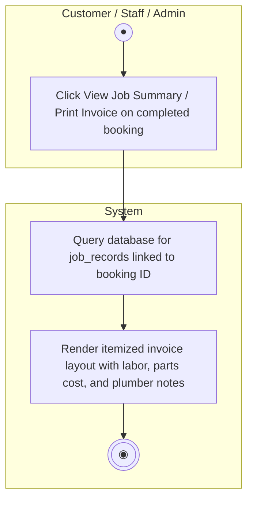
```mermaid
flowchart TD
    subgraph Actor_Lane ["Customer / Staff / Admin"]
        Start17((●)) --> A17_1[Click View Job Summary / Print Invoice on completed booking]
    end

    subgraph System_Lane ["System"]
        S17_1[Query database for job_records linked to booking ID]
        S17_2[Render itemized invoice layout with labor, parts cost, and plumber notes]
        End17(((◉)))

        A17_1 --> S17_1
        S17_1 --> S17_2
        S17_2 --> End17
    end
```

---

### 4.4.18 BAD018 Update Job Record

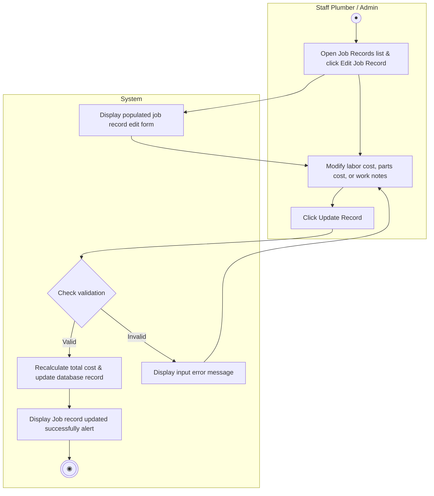
```mermaid
flowchart TD
    subgraph Actor_Lane ["Staff Plumber / Admin"]
        Start18((●)) --> A18_1[Open Job Records list & click Edit Job Record]
        A18_1 --> A18_2[Modify labor cost, parts cost, or work notes]
        A18_2 --> A18_3[Click Update Record]
    end

    subgraph System_Lane ["System"]
        S18_1[Display populated job record edit form]
        S18_2{Check validation}
        S18_3[Recalculate total cost & update database record]
        S18_4[Display Job record updated successfully alert]
        S18_5[Display input error message]
        End18(((◉)))

        A18_1 --> S18_1
        S18_1 --> A18_2
        A18_3 --> S18_2
        S18_2 -- Invalid --> S18_5
        S18_5 --> A18_2
        S18_2 -- Valid --> S18_3
        S18_3 --> S18_4
        S18_4 --> End18
    end
```

---

### 4.4.19 BAD019 Generate Report

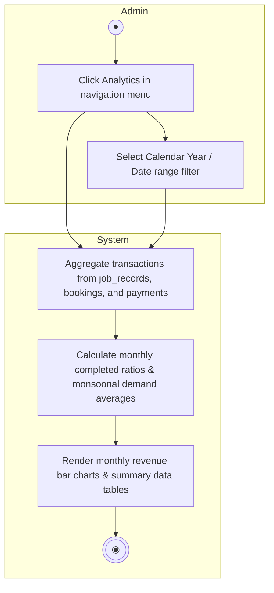
```mermaid
flowchart TD
    subgraph Actor_Lane ["Admin"]
        Start19((●)) --> A19_1[Click Analytics in navigation menu]
        A19_1 --> A19_2[Select Calendar Year / Date range filter]
    end

    subgraph System_Lane ["System"]
        S19_1[Aggregate transactions from job_records, bookings, and payments]
        S19_2[Calculate monthly completed ratios & monsoonal demand averages]
        S19_3[Render monthly revenue bar charts & summary data tables]
        End19(((◉)))

        A19_1 --> S19_1
        A19_2 --> S19_1
        S19_1 --> S19_2
        S19_2 --> S19_3
        S19_3 --> End19
    end
```

---

### 4.4.20 BAD020 Create Feedback

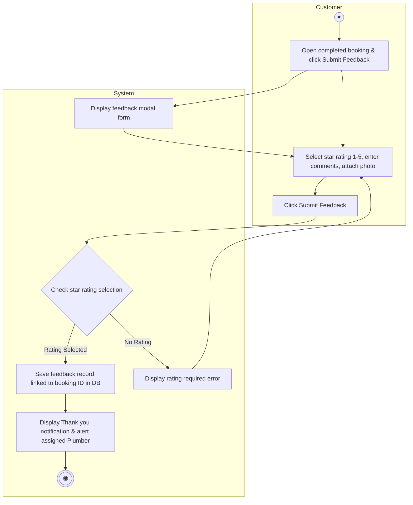
```mermaid
flowchart TD
    subgraph Actor_Lane ["Customer"]
        Start20((●)) --> A20_1[Open completed booking & click Submit Feedback]
        A20_1 --> A20_2[Select star rating 1-5, enter comments, attach photo]
        A20_2 --> A20_3[Click Submit Feedback]
    end

    subgraph System_Lane ["System"]
        S20_1[Display feedback modal form]
        S20_2{Check star rating selection}
        S20_3[Save feedback record linked to booking ID in DB]
        S20_4[Display Thank you notification & alert assigned Plumber]
        S20_5[Display rating required error]
        End20(((◉)))

        A20_1 --> S20_1
        S20_1 --> A20_2
        A20_3 --> S20_2
        S20_2 -- No Rating --> S20_5
        S20_5 --> A20_2
        S20_2 -- Rating Selected --> S20_3
        S20_3 --> S20_4
        S20_4 --> End20
    end
```

---

### 4.4.21 BAD021 View Feedback

```mermaid
flowchart TD
    subgraph Actor_Lane ["Staff / Admin"]
        Start21((●)) --> A21_1[Click Feedback menu tab]
        A21_1 --> A21_2[Select feedback & optionally type staff reply]
    end

    subgraph System_Lane ["System"]
        S21_1[Query database for feedback records & review photos]
        S21_2[Render customer ratings review feed & save staff response]
        End21(((◉)))

        A21_1 --> S21_1
        S21_1 --> S21_2
        S21_2 --> A21_2
        A21_2 --> End21
    end
```

---

### 4.4.22 BAD022 Create Chat Message

```mermaid
flowchart TD
    subgraph Actor_Lane ["Customer / Staff"]
        Start22((●)) --> A22_1[Open active booking & click Live Chat widget]
        A22_1 --> A22_2[Type text message into input bar & click Send]
    end

    subgraph System_Lane ["System"]
        S22_1[Display chat interface window]
        S22_2{Check text input non-empty}
        S22_3[Save ChatMessage in DB with is_read = false]
        S22_4[Broadcast Pusher event to recipient viewport]
        S22_5[Disable send button]
        End22(((◉)))

        A22_1 --> S22_1
        A22_2 --> S22_2
        S22_2 -- Empty --> S22_5
        S22_5 --> A22_2
        S22_2 -- Valid Text --> S22_3
        S22_3 --> S22_4
        S22_4 --> End22
    end
```

---

### 4.4.23 BAD023 View Chat Messages

```mermaid
flowchart TD
    subgraph Actor_Lane ["Customer / Staff / Admin"]
        Start23((●)) --> A23_1[Click Live Chat icon on booking]
    end

    subgraph System_Lane ["System"]
        S23_1[Retrieve message thread logs for booking ID]
        S23_2[Update unread messages setting is_read = true]
        S23_3[Render conversation bubble timeline view]
        End23(((◉)))

        A23_1 --> S23_1
        S23_1 --> S23_2
        S23_2 --> S23_3
        S23_3 --> End23
    end
```

---

### 4.4.24 BAD024 View Push Notifications

```mermaid
flowchart TD
    subgraph Actor_Lane ["Customer / Staff / Admin"]
        Start24((●)) --> A24_1[Click Notification Bell icon in header]
        A24_1 --> A24_2[Click notification item or Mark all as read]
    end

    subgraph System_Lane ["System"]
        S24_1[Fetch unread notifications for user ID from DB]
        S24_2[Display dropdown list showing top 5 alerts]
        S24_3[Update read_at timestamp in DB & reset bell counter to 0]
        End24(((◉)))

        A24_1 --> S24_1
        S24_1 --> S24_2
        S24_2 --> A24_2
        A24_2 --> S24_3
        S24_3 --> End24
    end
```
