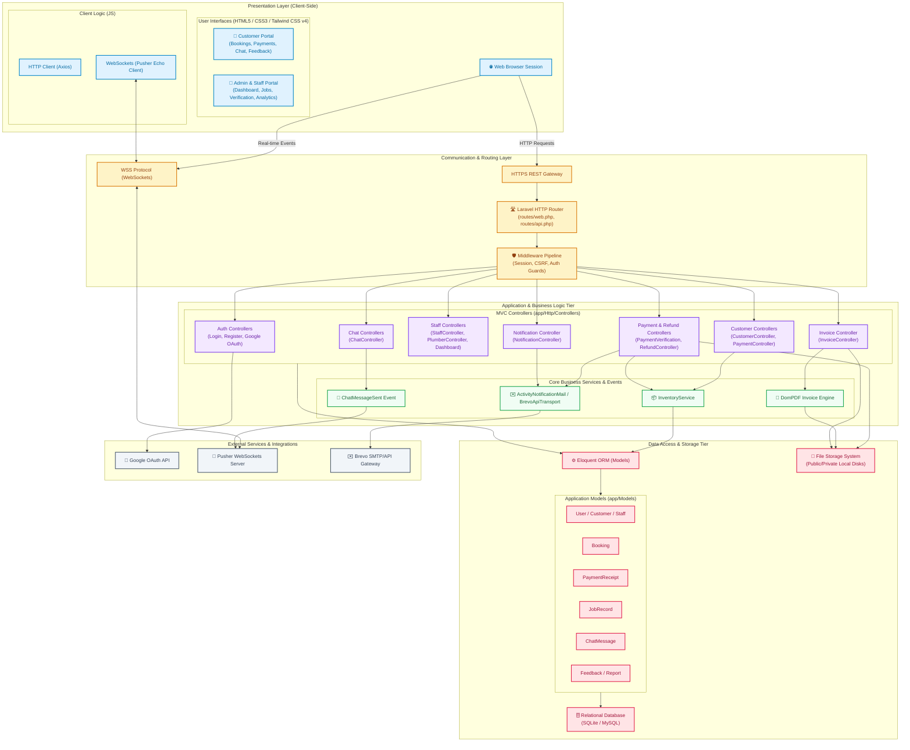
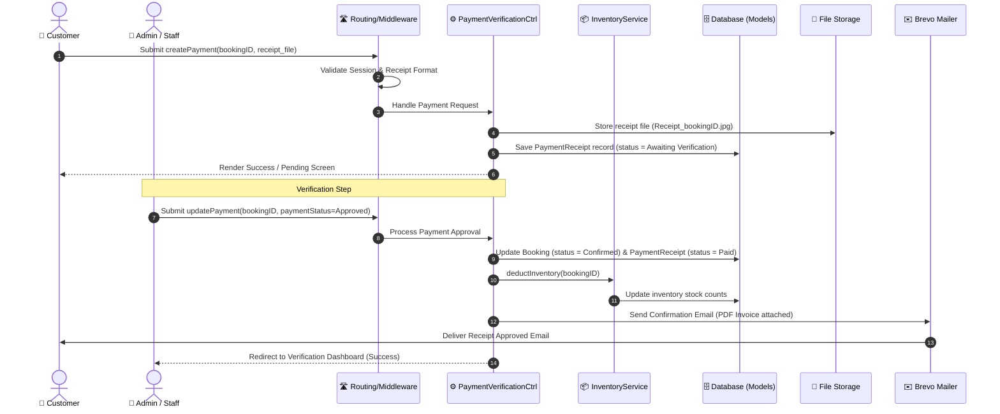
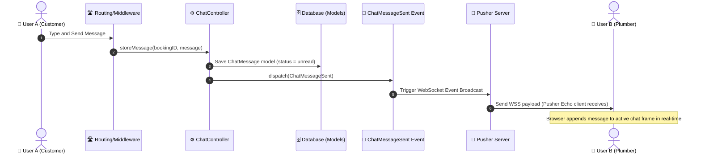

# Plumbfix System Architecture

This document describes the high-level system architecture of the **Plumbfix Plumbing Management System**. The architecture is structured in a multi-tier pattern, separating client presentation, routing/middleware, core application logic, data access, and third-party external integrations.

---

## Architecture Overview Diagram

The diagram below illustrates the components in each tier and their interactions. It utilizes custom visual styling to clearly distinguish between client, routing, application logic, data, and external service components.

---

## Tier Breakdown & Architecture Layers

### 1. Presentation Layer (Client-Side)
- **User Interfaces**: Formatted as responsive blade layouts powered by HTML5, CSS3, and Tailwind CSS v4. Different dashboards serve different portals:
  - *Customer Portal*: Manage bookings, submit deposits, review feedback, and initiate live chat.
  - *Admin & Staff Portal*: Review analytics charts, verify payments, manage inventory/plumber assignments, log job details, and reply to customers.
- **Client Scripts**: Standard HTTP REST interactions are made using `Axios`. Real-time notifications and message indicators use the `Pusher Echo` websocket library.

### 2. Communication & Routing Layer
- **Gateways**: Standard HTTP/HTTPS handles standard page fetches and form posts, while WSS (WebSocket Secure) is utilized for real-time messaging communication.
- **Laravel Router**: All entry points are mapped via `routes/web.php` or `routes/api.php`, mapping incoming HTTP verbs to specific controllers.
- **Middleware**: Intercepts requests to perform session state management, check CSRF tokens, verify active user roles, and apply authentication guards (e.g., redirecting unauthenticated traffic).

### 3. Application & Business Logic Tier
- **MVC Controllers**: Handles request parsing and coordinates interactions between services, models, and presentation outputs:
  - [GoogleAuthController](file:///c:/Users/adibi/plumbfix/app/Http/Controllers/Auth/GoogleAuthController.php): Integrates Socialite for Google OAuth login.
  - [CustomerController](file:///c:/Users/adibi/plumbfix/app/Http/Controllers/Customer/CustomerController.php) & [StaffController](file:///c:/Users/adibi/plumbfix/app/Http/Controllers/Staff/StaffController.php): Business operations for client-side bookings and admin management.
  - [PaymentVerificationController](file:///c:/Users/adibi/plumbfix/app/Http/Controllers/Staff/PaymentVerificationController.php) & [RefundController](file:///c:/Users/adibi/plumbfix/app/Http/Controllers/Staff/RefundController.php): Handlers for managing receipt processing, approval/rejection, and ledger balancing.
- **Core Business Services & Observers**:
  - [InventoryService](file:///c:/Users/adibi/plumbfix/app/Services/InventoryService.php): Automatically tracks, reserves, and updates plumbing equipment stock levels whenever a booking is created or updated.
  - **DomPDF Engine**: Renders HTML/CSS views into strict PDF invoices and receipt vouchers.
  - [BrevoApiTransport](file:///c:/Users/adibi/plumbfix/app/Mail/BrevoApiTransport.php): Custom transport layer that sends transaction emails and activity notifications using the Brevo SMTP API.

### 4. Data Access & Storage Tier
- **Eloquent ORM**: Translates SQL rows to object-oriented representation via Active Record.
- **Application Models**:
  - [User](file:///c:/Users/adibi/plumbfix/app/Models/User.php), [Customer](file:///c:/Users/adibi/plumbfix/app/Models/Customer.php), [Staff](file:///c:/Users/adibi/plumbfix/app/Models/Staff.php): Identity and user role definitions.
  - [Booking](file:///c:/Users/adibi/plumbfix/app/Models/Booking.php): The core domain model representing service appointments, timestamps, status, and plumber assignments.
  - [PaymentReceipt](file:///c:/Users/adibi/plumbfix/app/Models/PaymentReceipt.php) & [JobRecord](file:///c:/Users/adibi/plumbfix/app/Models/JobRecord.php): Documents financial transactions and plumber task sheets.
- **Relational Database**: Relational engine (SQLite for local testing/MySQL for production) storing tables and foreign-key constraints.
- **Storage Subsystem**: Public and private storage disks containing user-uploaded transaction receipts, plumber job photos, and compiled invoice PDFs.

### 5. External Integrations
- **Google OAuth**: Third-party secure credentials delegate authentication.
- **Pusher WebSockets**: Broadcasts event payloads to client connections, enabling instant customer-to-plumber chat.
- **Brevo API Gateway**: Delivers automated status emails for payment confirmations, booking schedules, and warnings.

---

## Core System Integration Flows

Below are sequence representations of key cross-tier workflows.

### Flow A: Deposit Payment Upload and Verification

### Flow B: Real-Time Communication

