# Plumbfix Multilayer System Sequence Diagrams (SSD)

This document contains the Multilayer System Sequence Diagrams (SSDs) mapped directly from the **Plumbfix: Plumbing Management System Use Case Diagram**. Each SSD represents a 5-layer software architecture flow:
1. **Actor** (Initiator: Admin/Staff or Customer)
2. **View (UI Layer)**: Blade templates and front-end pages
3. **Controller (Logical Layer)**: Laravel Controllers handling routing and business logic
4. **Model (Object Entity Layer)**: Laravel Eloquent Models representing core abstractions
5. **Database (Data Access Layer)**: The database engine executing SQL commands

---

## Table of Contents

1. [Architectural Layer Definitions](#architectural-layer-definitions)
2. [System Sequence Diagrams](#system-sequence-diagrams)
   - [UC-01: Login](#uc-01-login)
   - [UC-02: Create Account](#uc-02-create-account)
   - [UC-03: View Account](#uc-03-view-account)
   - [UC-04: Update Account](#uc-04-update-account)
   - [UC-05: Delete Account](#uc-05-delete-account)
   - [UC-06: Create Booking](#uc-06-create-booking)
   - [UC-07: View Booking](#uc-07-view-booking)
   - [UC-08: Update Booking](#uc-08-update-booking)
   - [UC-09: Delete Booking](#uc-09-delete-booking)
   - [UC-10: Create payment](#uc-10-create-payment)
   - [UC-11: View Payment](#uc-11-view-payment)
   - [UC-12: Update payment](#uc-12-update-payment)
   - [UC-13: Create Refund](#uc-13-create-refund)
   - [UC-14: View Refund](#uc-14-view-refund)
   - [UC-15: Update Refund](#uc-15-update-refund)
   - [UC-16: Create Job Record](#uc-16-create-job-record)
   - [UC-17: View Job Record](#uc-17-view-job-record)
   - [UC-18: Update Job Record](#uc-18-update-job-record)
   - [UC-19: Generate Report](#uc-19-generate-report)
   - [UC-20: Create Feedback](#uc-20-create-feedback)
   - [UC-21: View Feedback](#uc-21-view-feedback)
   - [UC-22: Create Chat Message](#uc-22-create-chat-message)
   - [UC-23: View Chat Messages](#uc-23-view-chat-messages)
   - [UC-24: View Push Notifications](#uc-24-view-push-notifications)

---

## Architectural Layer Definitions

- **Actor**: The human operator triggering the request. Classified as **Customer** or **Admin/Staff** (Admins or Plumbers).
- **View**: The browser frontend interface containing Blade templates (e.g. `login.blade.php`, `customer/dashboard.blade.php`, `staff/bookings.blade.php`) which renders forms, handles button clicks, and processes input files.
- **Controller**: Laravel Controller classes (e.g. `LoginController`, `CustomerController`, `StaffController`, `PaymentController`, `ChatController`) where request arguments are validated, policies checked, and workflows executed.
- **Model**: Eloquent Models representing relational database maps (`Customer`, `Staff`, `Booking`, `PaymentReceipt`, `JobRecord`, `Feedback`, `ChatMessage`, `Notification`).
- **Database (DB)**: The MySQL Database engine execution. It runs query instructions such as `SELECT`, `INSERT`, `UPDATE`, and `DELETE`.

---

## System Sequence Diagrams

### UC-01: Login
Authenticates and logs in a Customer or Admin/Staff into their session.

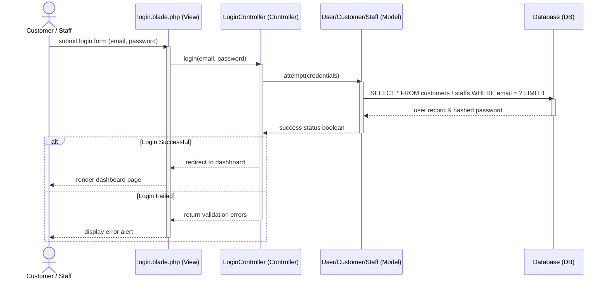

---

### UC-02: Create Account
Used by new Customers to register, or Admins to register a new plumber/staff profile.

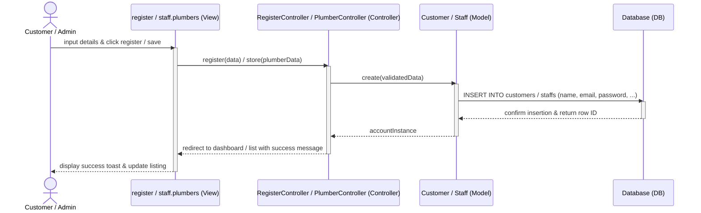

---

### UC-03: View Account
Retrieves and displays the Customer or Staff profile details on the user interface.

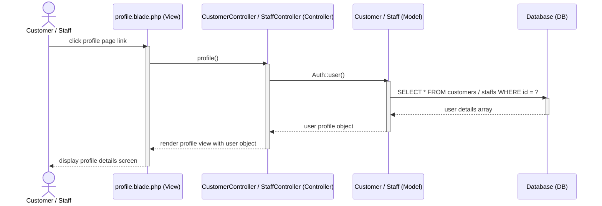

---

### UC-04: Update Account
Saves changes made to the user profile (e.g. addresses, password edits).

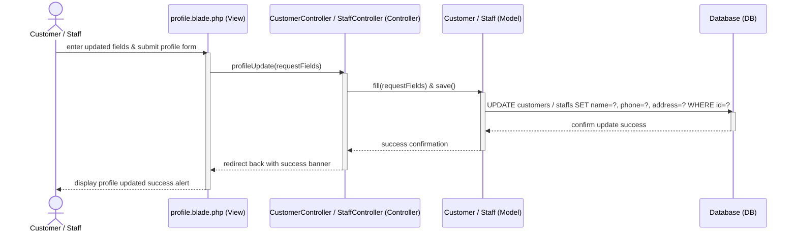

---

### UC-05: Delete Account
Admins delete a plumber profile, or Customer accounts are deactivated.

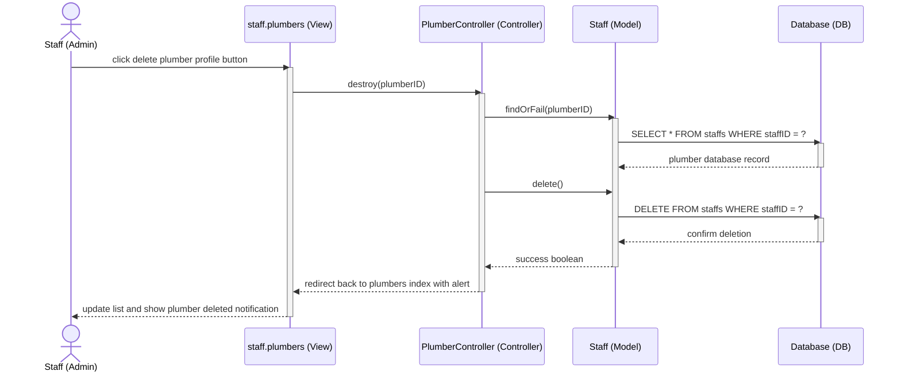

---

### UC-06: Create Booking
Customers reserve a service booking slot by detailing their issue.

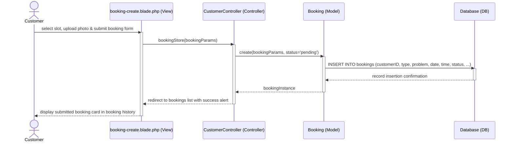

---

### UC-07: View Booking
Fetches details of past or pending booking appointments.

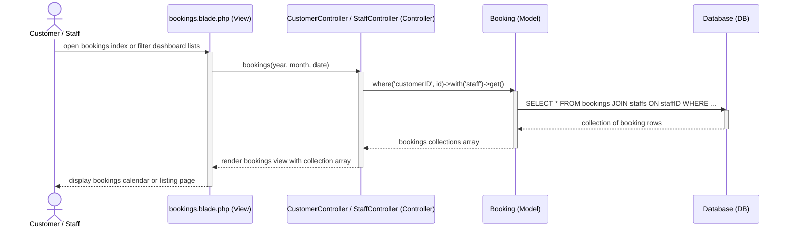

---

### UC-08: Update Booking
Staff members update scheduled times, update statuses, or assign plumbers.

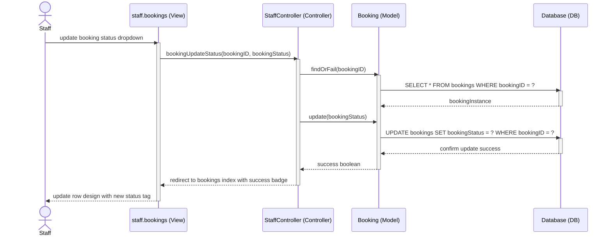

---

### UC-09: Delete Booking
Customers cancel an existing booking request, releasing the scheduled slot.

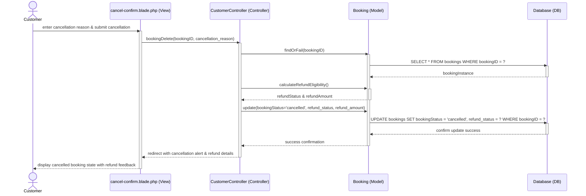

---

### UC-10: Create payment
Customers upload deposit receipt screenshots to confirm a booking schedule.

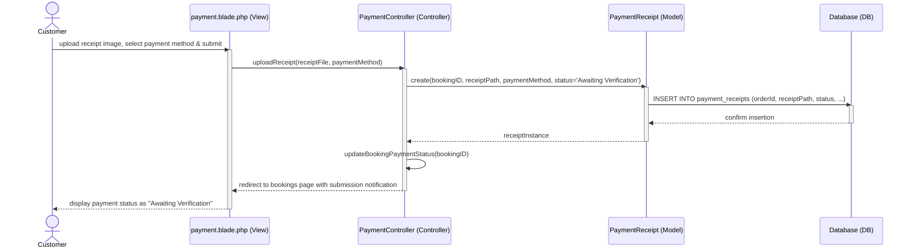

---

### UC-11: View Payment
Allows Customer and Admin/Staff to verify transaction receipts and download PDFs.

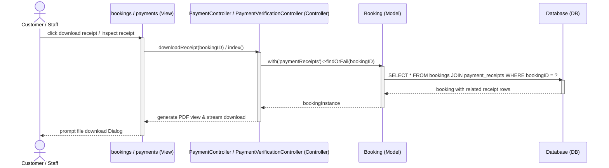

---

### UC-12: Update payment
Admins verify, approve (assigning a plumber) or reject payment receipts.

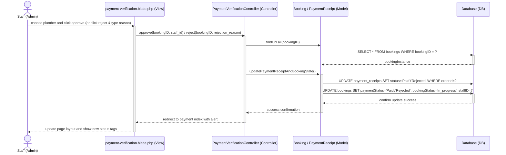

---

### UC-13: Create Refund
Cancellations automatically generate refund entries in the bookings table.

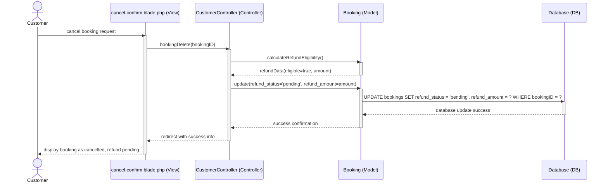

---

### UC-14: View Refund
Allows Customer and Admin/Staff to review status details of refunds.

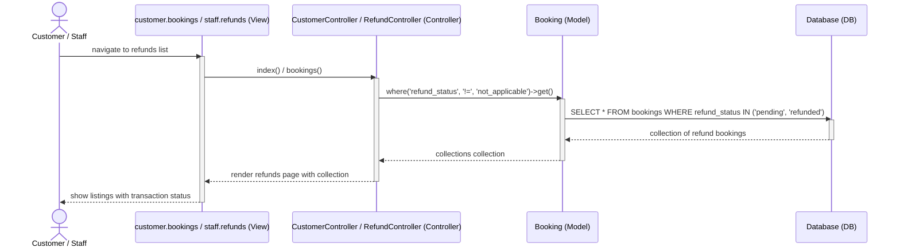

---

### UC-15: Update Refund
Admins upload refund proof receipts to settle pending refunds.

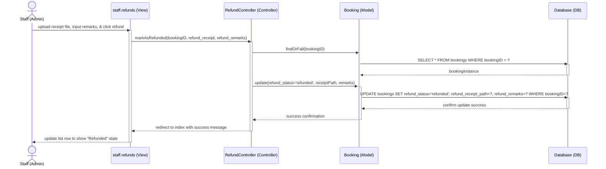

---

### UC-16: Create Job Record
Plumbers document service tasks, costs, and notes on job completion.

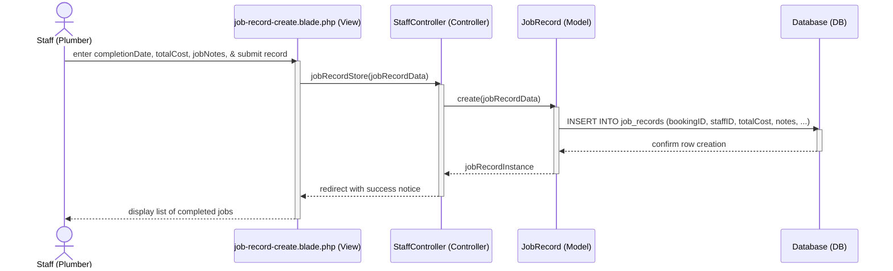

---

### UC-17: View Job Record
Customers and staff inspect the final job summary, total cost, and invoice.

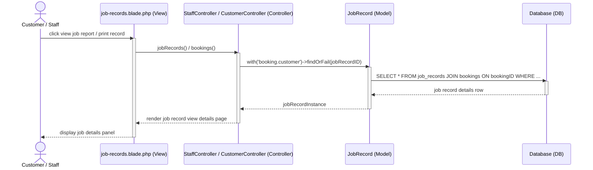

---

### UC-18: Update Job Record
Plumbers edit costs, completion details, or notes of already logged job reports.

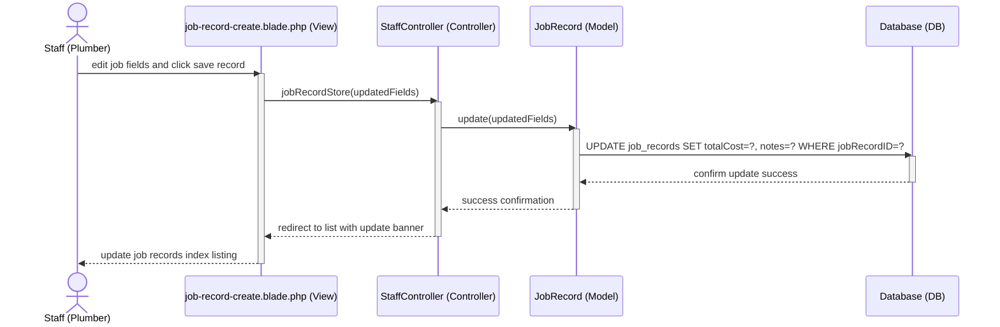

---

### UC-19: Generate Report
Admins review sales, earnings, active customers, and performance analytics.

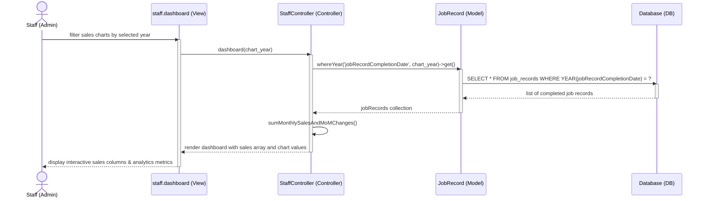

---

### UC-20: Create Feedback
Customers submit reviews and rating scores for completed plumbing tasks.

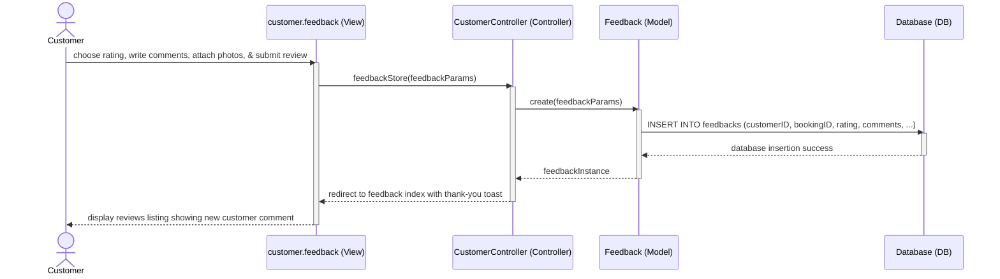

---

### UC-21: View Feedback
Both Customer and Admin/Staff read review comments and reply messages.

```mermaid
sequenceDiagram
    actor User as Customer / Staff
    participant View as feedback.blade.php (View)
    participant Controller as CustomerController / StaffController (Controller)
    participant Model as Feedback (Model)
    participant DB as Database (DB)
    
    User->>View: open feedback review boards
    activate View
    View->>Controller: feedback()
    activate Controller
    Controller->>Model: with('customer', 'booking')->get()
    activate Model
    Model->>DB: SELECT * FROM feedbacks JOIN customers JOIN bookings
    activate DB
    DB-->>Model: feedbacks array listing
    deactivate DB
    Model-->>Controller: feedback collection
    deactivate Model
    Controller-->>View: render feedback list template
    deactivate Controller
    View-->>User: display feedback records, ratings & staff responses
    deactivate View
```

---

### UC-22: Create Chat Message
Real-time discussion regarding plumbing problems between customers and plumbers.

```mermaid
sequenceDiagram
    actor User as Customer / Staff
    participant View as chat.blade.php (View)
    participant Controller as ChatController (Controller)
    participant Model as ChatMessage (Model)
    participant DB as Database (DB)
    
    User->>View: type chat message and click send button
    activate View
    View->>Controller: sendMessage(bookingID, messageText)
    activate Controller
    Controller->>Model: create(bookingID, messageText, sender_type, sender_id)
    activate Model
    Model->>DB: INSERT INTO chat_messages (bookingID, message, sender_type, sender_id)
    activate DB
    DB-->>Model: confirm message insertion
    deactivate DB
    Model-->>Controller: chatMessageInstance
    deactivate Model
    Controller->>Controller: broadcast(ChatMessageSent) & notifyRecipient()
    Controller-->>View: return JSON message payload response
    deactivate Controller
    View-->>User: append message box in chat window timeline
    deactivate View
```

---

### UC-23: View Chat Messages
Loads all previous chat messages of a booking and updates read status flags.

```mermaid
sequenceDiagram
    actor User as Customer / Staff
    participant View as chat.blade.php (View)
    participant Controller as ChatController (Controller)
    participant Model as ChatMessage (Model)
    participant DB as Database (DB)
    
    User->>View: navigate to booking chat view page
    activate View
    View->>Controller: getMessages(bookingID)
    activate Controller
    Controller->>Model: where('bookingID', bookingID)->get()
    activate Model
    Model->>DB: SELECT * FROM chat_messages WHERE bookingID = ?
    activate DB
    DB-->>Model: message records list
    deactivate DB
    Controller->>Model: update(is_read=true) (for unread incoming messages)
    Model->>DB: UPDATE chat_messages SET is_read=true WHERE bookingID=? AND sender_type!=?
    activate DB
    DB-->>Model: confirm read status update success
    deactivate DB
    Model-->>Controller: chatMessageCollection
    deactivate Model
    Controller-->>View: return chatMessageCollection JSON response
    deactivate Controller
    View-->>User: display historical chat conversation timeline
    deactivate View
```

---

### UC-24: View Push Notifications
Loads user-specific notifications to inform them about status adjustments.

```mermaid
sequenceDiagram
    actor User as Customer / Staff
    participant View as layout.navigation (View)
    participant Controller as NotificationController (Controller)
    participant Model as Notification (Model)
    participant DB as Database (DB)
    
    User->>View: click navigation notification dropdown bell icon
    activate View
    View->>Controller: getUnreadNotifications()
    activate Controller
    Controller->>Model: Auth::user()->unreadNotifications()->get()
    activate Model
    Model->>DB: SELECT * FROM notifications WHERE notifiable_id=? AND read_at IS NULL
    activate DB
    DB-->>Model: notifications list array
    deactivate DB
    Model-->>Controller: unreadNotifications collection
    deactivate Model
    Controller-->>View: return notifications list JSON response
    deactivate Controller
    View-->>User: display unread notification items in header dropdown list
    deactivate View
```
