# 4.6 System Sequence Diagrams (SSD)

This document contains the complete set of **System Sequence Diagrams (SSD001 through SSD024)** for the **Plumbfix Plumbing Management System**. Each diagram depicts the direct interaction between the **Actor** and the **:System**.

---

## Table of Contents

1. [4.6.1 SSD001: Create Account](#461-ssd001-create-account)
2. [4.6.2 SSD002: Login](#462-ssd002-login)
3. [4.6.3 SSD003: View Account](#463-ssd003-view-account)
4. [4.6.4 SSD004: Update Account](#464-ssd004-update-account)
5. [4.6.5 SSD005: Delete Account](#465-ssd005-delete-account)
6. [4.6.6 SSD006: Create Booking](#466-ssd006-create-booking)
7. [4.6.7 SSD007: View Booking](#467-ssd007-view-booking)
8. [4.6.8 SSD008: Update Booking](#468-ssd008-update-booking)
9. [4.6.9 SSD009: Delete Booking](#469-ssd009-delete-booking)
10. [4.6.10 SSD010: Create Payment](#4610-ssd010-create-payment)
11. [4.6.11 SSD011: View Payment](#4611-ssd011-view-payment)
12. [4.6.12 SSD012: Update Payment](#4612-ssd012-update-payment)
13. [4.6.13 SSD013: Create Refund](#4613-ssd013-create-refund)
14. [4.6.14 SSD014: View Refund](#4614-ssd014-view-refund)
15. [4.6.15 SSD015: Update Refund](#4615-ssd015-update-refund)
16. [4.6.16 SSD016: Create Job Record](#4616-ssd016-create-job-record)
17. [4.6.17 SSD017: View Job Record](#4617-ssd017-view-job-record)
18. [4.6.18 SSD018: Update Job Record](#4618-ssd018-update-job-record)
19. [4.6.19 SSD019: Generate Report](#4619-ssd019-generate-report)
20. [4.6.20 SSD020: Create Feedback](#4620-ssd020-create-feedback)
21. [4.6.21 SSD021: View Feedback](#4621-ssd021-view-feedback)
22. [4.6.22 SSD022: Create Chat Message](#4622-ssd022-create-chat-message)
23. [4.6.23 SSD023: View Chat Messages](#4623-ssd023-view-chat-messages)
24. [4.6.24 SSD024: View Push Notifications](#4624-ssd024-view-push-notifications)

---

## 4.6.1 SSD001 Create Account

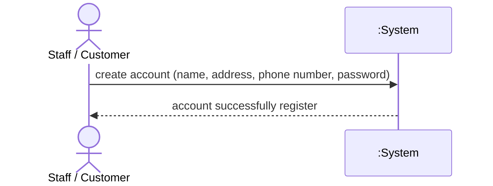

---

## 4.6.2 SSD002 Login

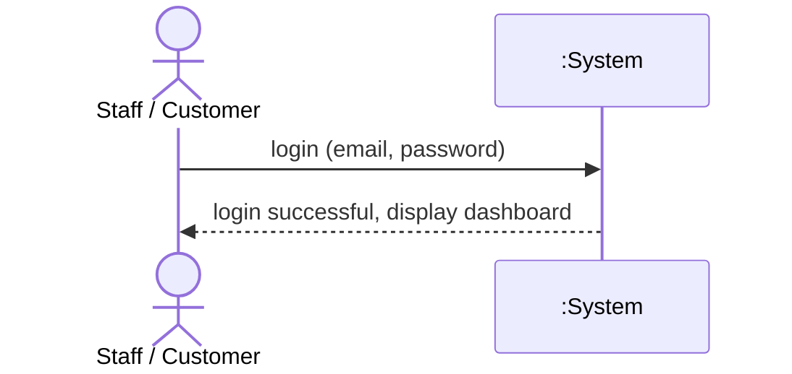

---

## 4.6.3 SSD003 View Account

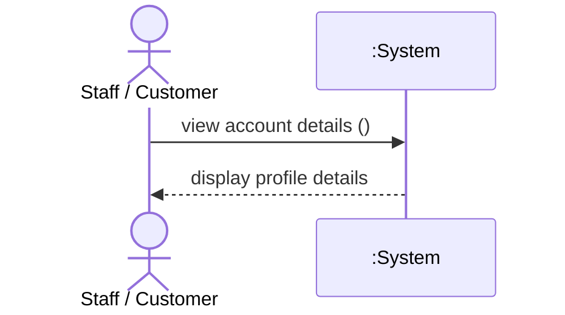

---

## 4.6.4 SSD004 Update Account

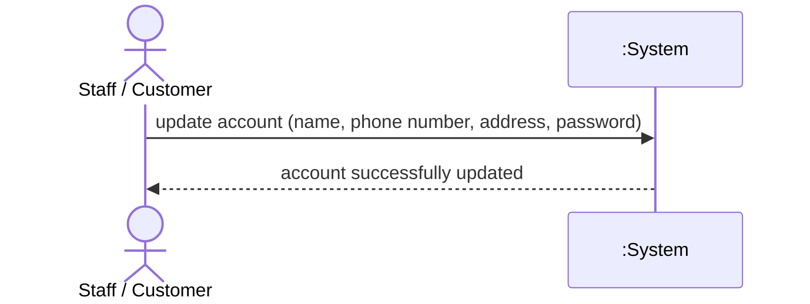

---

## 4.6.5 SSD005 Delete Account

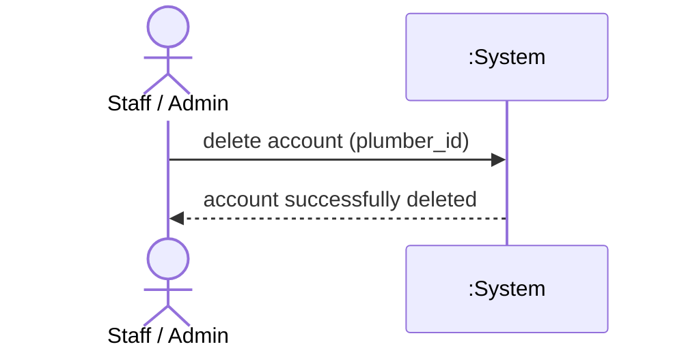

---

## 4.6.6 SSD006 Create Booking

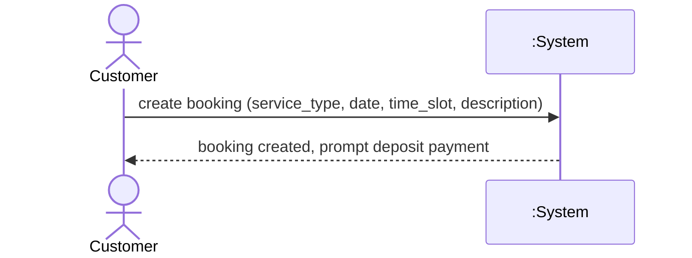

---

## 4.6.7 SSD007 View Booking

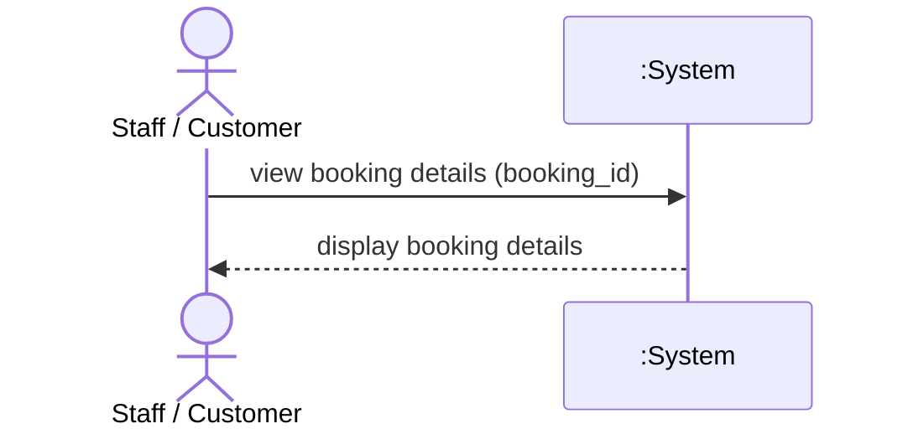

---

## 4.6.8 SSD008 Update Booking


---

## 4.6.9 SSD009 Delete Booking

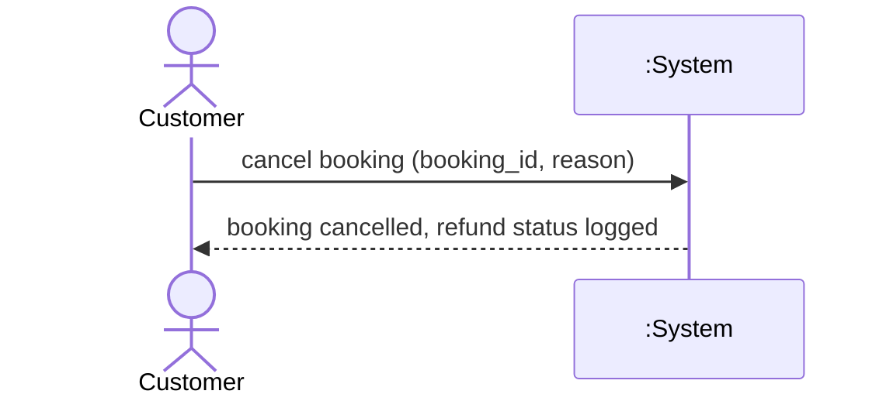

---

## 4.6.10 SSD010 Create Payment

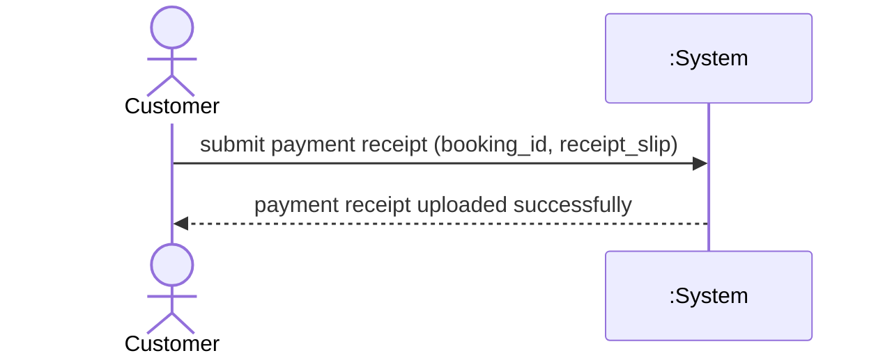

---

## 4.6.11 SSD011 View Payment

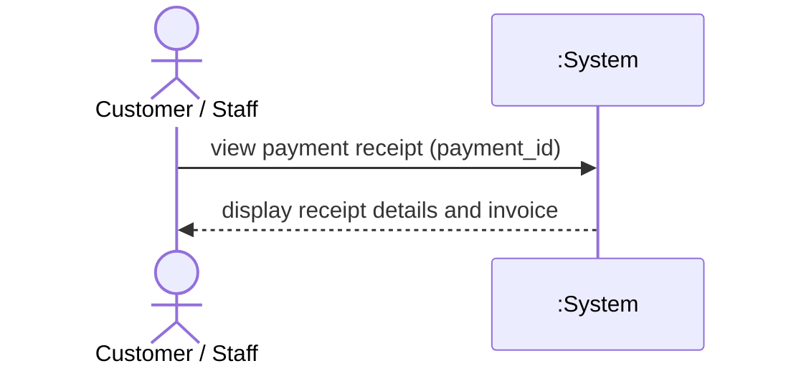

---

## 4.6.12 SSD012 Update Payment


---

## 4.6.13 SSD013 Create Refund

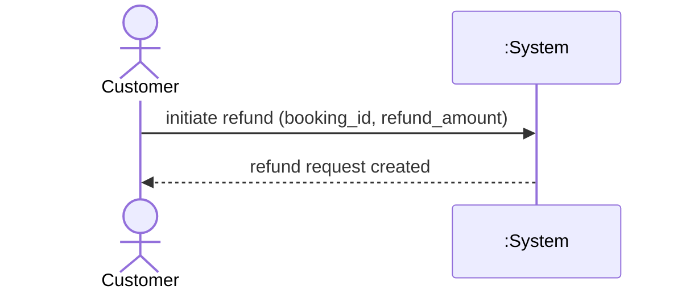

---

## 4.6.14 SSD014 View Refund

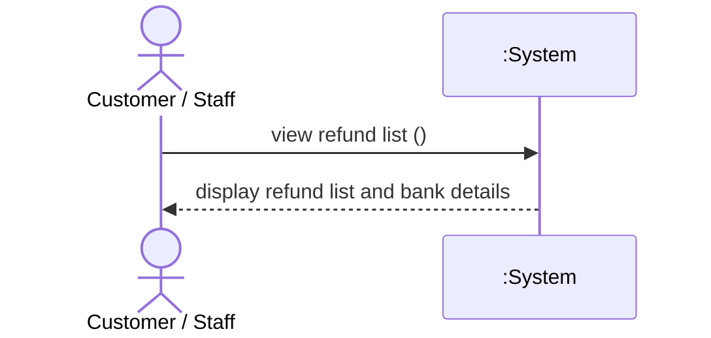

---

## 4.6.15 SSD015 Update Refund

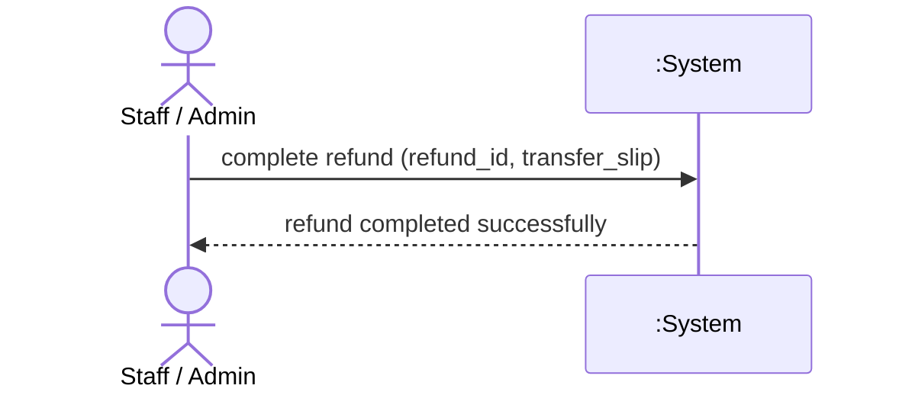

---

## 4.6.16 SSD016 Create Job Record

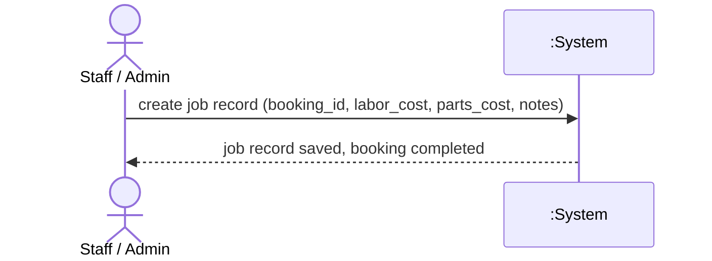

---

## 4.6.17 SSD017 View Job Record

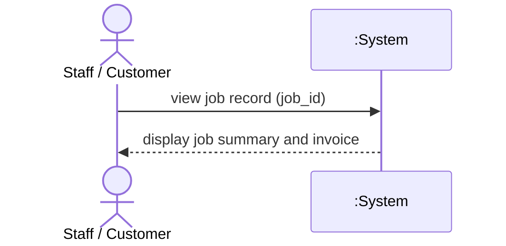

---

## 4.6.18 SSD018 Update Job Record

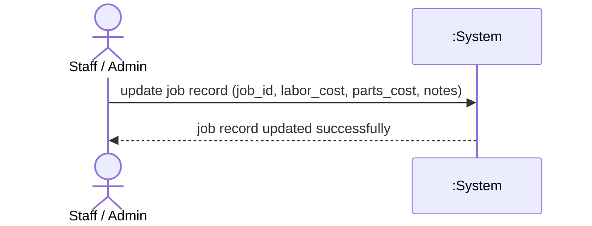

---

## 4.6.19 SSD019 Generate Report

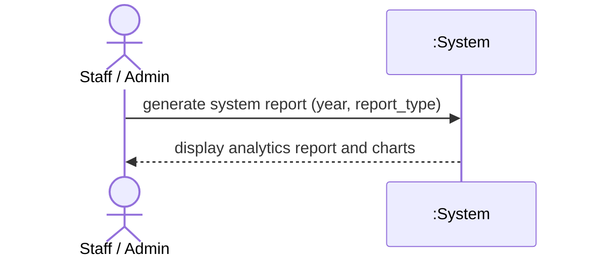

---

## 4.6.20 SSD020 Create Feedback

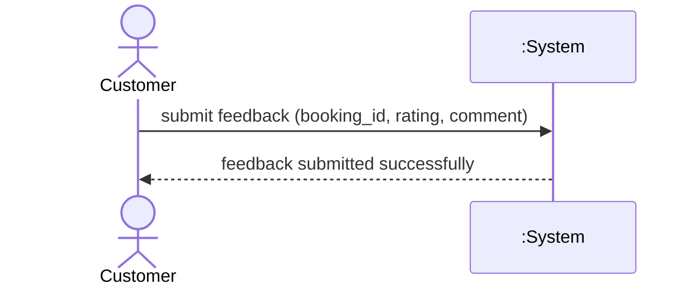

---

## 4.6.21 SSD021 View Feedback

```mermaid
sequenceDiagram
    actor User as Customer
    participant System as :System

    User->>System: view feedback list ()
    System-->>User: display feedback list and ratings
```

---

## 4.6.22 SSD022 Create Chat Message

```mermaid
sequenceDiagram
    actor User as Customer / Staff
    participant System as :System

    User->>System: send chat message (booking_id, message_text)
    System-->>User: message sent successfully
```

---

## 4.6.23 SSD023 View Chat Messages

```mermaid
sequenceDiagram
    actor User as Customer / Staff
    participant System as :System

    User->>System: view chat history (booking_id)
    System-->>User: display chat message history
```

---

## 4.6.24 SSD024 View Push Notifications

```mermaid
sequenceDiagram
    actor User as Staff / Customer
    participant System as :System

    User->>System: view notifications ()
    System-->>User: display unread notification list
```
